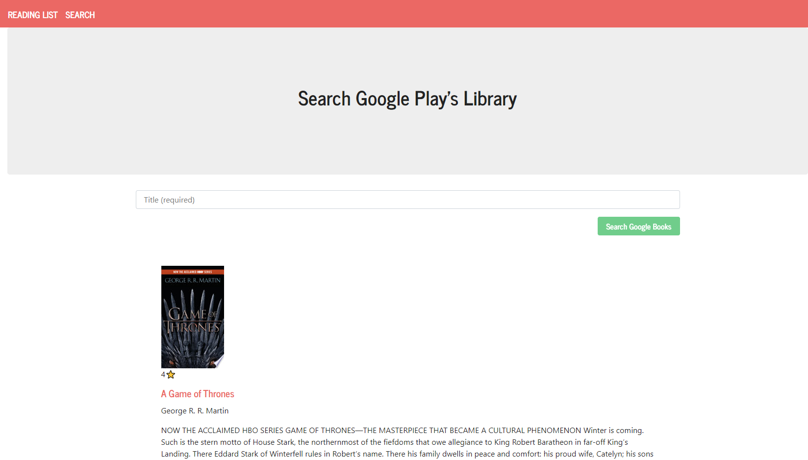

# Google Books React 

## Description
    A personal reading list app for my favorite online book store.

  
  ## Table of Contents
  1. [UserStory](#UserStory)
  2. [Installation](#Installation)
  3. [Usage](#Usage)
  4. [Tests](#Tests)
  5. [GitHub Links](#GitHubLinks)

## User Story

    As a user, I want to be able to create a reading list and search a major online retailer for books to add to said reading list.

  ## Installation
  
    NPM install will install all the needed dependencies.
  
  ## Usage

    The website is also deployed live.
  
  ## Tests
  
    No Tests provided.
   
  ## GitHubLinks
  
  [Git Hub Username](https://www.github.com/CodySamuels)
  
  [The Repo](https://github.com/CodySamuels/employee-directory)

  [The Deployed Link](https://cs-employee-directory.herokuapp.com/)